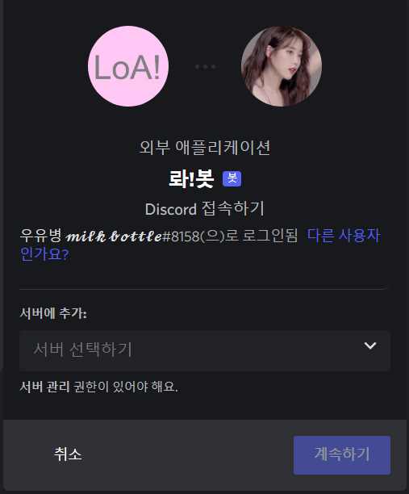
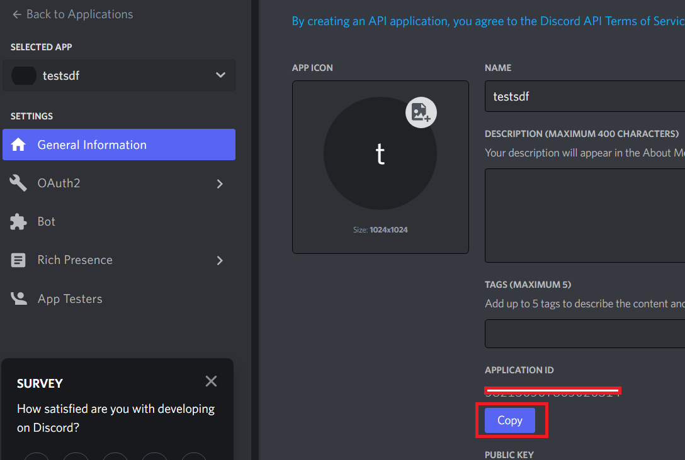
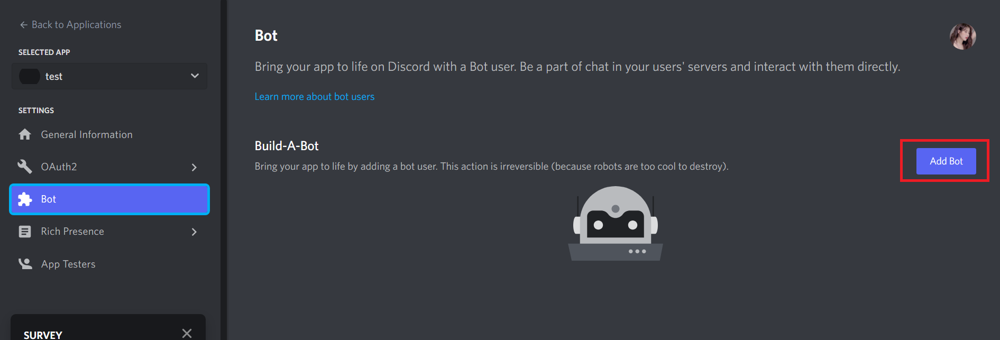
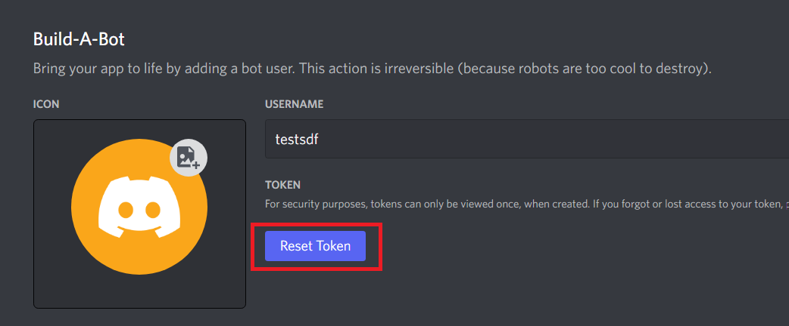
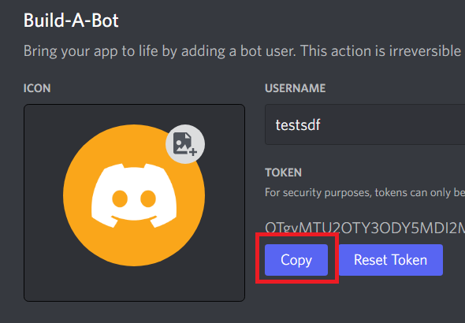
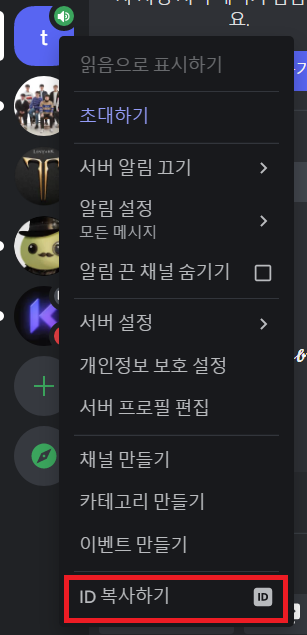
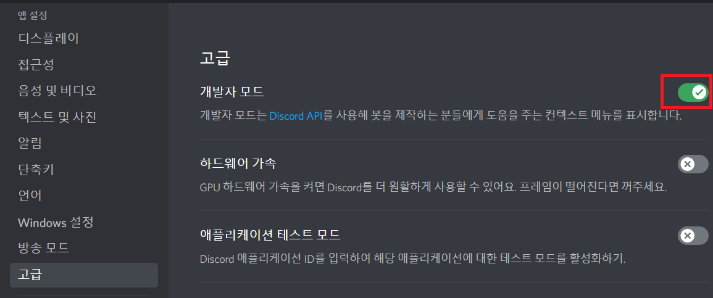
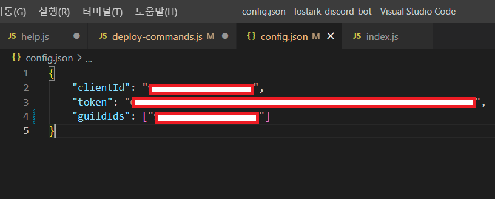

# 로스트아크 디스코드 봇

최근 유행하는 Smilegate 사의  로스트아크에 관한 유틸리티와 정보들을 제공하는 디스코드 봇입니다.


## About the Project

### Project motivation

> 로스트아크라는 게임을 하면서 항상 검색만으로 정보를 가져왔습니다. 이 점이 불편해서 다양한 기능을 제공하는 어플리케이션을 만들어 볼까 고민하다가, 게이머들이 가장 많이 쓰는 디스코드가 떠올랐습니다. 요즘은 디스코드의 봇 기능을 통해 다양한 도움을 받을 수 있고 마침 오픈소스 강의에서 챗봇에 관한 정보를 배우기 때문에 디스코드 봇으로 이런 도움을 제공하는 프로그램을 설계하기로 했습니다.

### Used things

+ Node.js

+ Discord.js

+ Heroku

+ 로스트아크 공식 홈페이지

+ 로아와 전투정보실 검색 홈페이지

## Getting Started

### Invitation Bot

[**로스트아크 디스코드 봇 초대하기**](https://discord.com/api/oauth2/authorize?client_id=951774447977771068&permissions=0&scope=applications.commands%20bot)

위의 링크를 클릭 후 원하는 디스코드 서버를 선택하고 **계속하기**를 누르면 봇을 서버에 초대할 수 있습니다. 



### Installation (For contributor)

**복사를 3번 하므로 메모장이나 텍스트를 저장할 프로그램을 실행해주세요**

* 해당 링크에서 디스코드 봇 Application을 생성합니다. [Discord Developer](https://discord.com/developers/applications)

​	New Application - 봇 이름 설정 - Create (봇 이름은 Unique하게 설정해주세요)

* General Information 카테고리에서 Application ID를 복사합니다.



* SELECTED APP에서 생성한 봇을 선택하고 Bot카테고리 - Build-A-Bot에서 Add Bot을 합니다. 



* Reset Token을 통해 봇의 Token을 발급합니다.



* 봇의 Token을 복사합니다.



* 봇을 테스트할 디스코드 테스트서버를 생성합니다.

* 디스코드서버의 ID를 복사합니다. (서버 우클릭 후 ID 복사)



p.s. ID복사하기 버튼이 보이지 않는다면 디스코드 개인 프로필의 설정(톱니바퀴)-고급-개발자 모드를 ON 합니다.



* config.json의 데이터에 복사한 값을 넣습니다.



p.s. clientId는 첫 번째로 복사한 Application ID, token은 두 번째로 복사한 Bot의 Token,
       guildIds는 세 번째로 복사한 디스코드 서버의 ID입니다.

* 이후 deploy-commands.js를 한 번 실행해주면 Slash command 개발이 준비가 완료됩니다.

## Usage

### Command List

**/도움** 사용할 수 있는 모든 명령어들을 조회합니다

**/도움 <명령어>** <명령어>에 해당하는 명령어의 사용방법을 조회합니다.

**/마리샵** 마리샵에 등록 된 아이템들의 정보를 조회합니다.

**/정보 <닉네임>** 해당 캐릭터의 정보를 조회합니다.

**/로아와 <닉네임>** 해당 캐릭터의 로아와 홈페이지로 이동합니다.

**/나침반** 금일의 프로키온 나침반 스케줄을 조회합니다.

**/용어 <단어>** <단어>에 해당하는 로스트아크 용어를 조회합니다.

**/경매 <시세> <인원>** 최적의 경매금 입찰가를 계산합니다.

## Contributing

1. 해당 Repository를 fork 합니다.

```git fork http://khuhub.khu.ac.kr/2019102200/lostark-discord-bot.git ```

2. 본인의 프로젝트로 fork된 Repository를 clone 합니다.

```git clone http://khuhub.khu.ac.kr/YOUR_ID/lostark-discord-bot.git```

3. 새로운 기능에 해당하는 feature branch를 만듭니다.

```git checkout -b feature/NEW_FEATURE```

4. 기능을 만들어 commit합니다.

```git commit -m "Update new feature"```

5. 기능을 다 만들었다면 push합니다.

```git push origin feature/NEW_FEATURE```

6. pull request를 합니다.

## License

> MIT LicenseCopyright (c) 2022 Byeongwoo Yu and other contributors
>
> Permission is hereby granted, free of charge, to any person obtaining a copy of this software and associated documentation files (the "Software"), to deal in the Software without restriction, including without limitation the rights to use, copy, modify, merge, publish, distribute, sublicense, and/or sell copies of the Software, and to permit persons to whom the Software is furnished to do so, subject to the following conditions:The above copyright notice and this permission notice shall be included in all copies or substantial portions of the Software.
>
> THE SOFTWARE IS PROVIDED "AS IS", WITHOUT WARRANTY OF ANY KIND, EXPRESS OR IMPLIED, INCLUDING BUT NOT LIMITED TO THE WARRANTIES OF MERCHANTABILITY, FITNESS FOR A PARTICULAR PURPOSE AND NONINFRINGEMENT. IN NO EVENT SHALL THE AUTHORS OR COPYRIGHT HOLDERS BE LIABLE FOR ANY CLAIM, DAMAGES OR OTHER LIABILITY, WHETHER IN AN ACTION OF CONTRACT, TORT OR OTHERWISE, ARISING FROM, OUT OF OR IN CONNECTION WITH THE SOFTWARE OR THE USE OR OTHER DEALINGS IN THE SOFTWARE.

## Contact

* 2019102200 유병우 [이메일](err404@khu.ac.kr)
* 2019102164 남우성 [이메일](dntjd123kr@khu.ac.kr)

